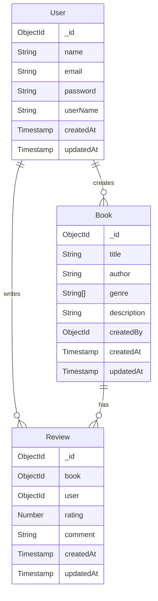

# Book Review API - Database Schema Design

## Entity Relationship Diagram (ERD)



## Schema Details

### User Schema

```javascript
{
    name: {
        type: String,
        required: true
    },
    email: {
        type: String,
        required: true,
        unique: true
    },
    password: {
        type: String,
        required: true
    },
    userName: {
        type: String,
        required: true,
        unique: true
    }
}
```

### Book Schema

```javascript
{
    title: {
        type: String,
        required: true,
        trim: true
    },
    author: {
        type: String,
        required: true,
        trim: true
    },
    genre: {
        type: [String],
        required: true,
        validate: {
            validator: function(v) {
                return v && v.length > 0;
            },
            message: "At least one genre is required"
        }
    },
    description: {
        type: String,
        required: true
    },
    createdBy: {
        type: ObjectId,
        ref: 'User',
        required: true
    }
}
```

### Review Schema

```javascript
{
    book: {
        type: ObjectId,
        ref: 'Book',
        required: true
    },
    user: {
        type: ObjectId,
        ref: 'User',
        required: true
    },
    rating: {
        type: Number,
        required: true,
        min: 1,
        max: 5
    },
    comment: {
        type: String,
        required: true,
        trim: true
    }
}
```

## Virtual Fields

### Book Virtual Fields

1. **averageRating**

    - Calculates the average rating from all reviews
    - Returns 0 if no reviews exist
    - Rounded to 1 decimal place

2. **reviews**
    - Virtual population of all reviews for the book
    - Includes user information for each review

## Indexes

### User Collection

-   `email`: Unique index
-   `userName`: Unique index

### Book Collection

-   `title`: Text index (for search)
-   `author`: Text index (for search)
-   `genre`: Multi-key index (for filtering by any genre in the array)

### Review Collection

-   Compound index on `{ book: 1, user: 1 }`: Unique (ensures one review per user per book)
-   `book`: Index (for querying reviews by book)
-   `user`: Index (for querying reviews by user)

## Relationships

1. **User to Book (1:N)**

    - One user can create multiple books
    - Each book must have one creator

2. **User to Review (1:N)**

    - One user can write multiple reviews
    - Each review must have one author

3. **Book to Review (1:N)**
    - One book can have multiple reviews
    - Each review must be associated with one book

## Data Validation

1. **User Validation**

    - Email must be unique and valid
    - Username must be unique
    - Password is required

2. **Book Validation**

    - Title, author are required and trimmed
    - Genre is an array of strings with at least one genre required
    - Description is required
    - Creator reference is required

3. **Review Validation**
    - Rating must be between 1 and 5
    - Comment is required and trimmed
    - One review per user per book (enforced by unique index)
    - Both book and user references are required

## Timestamps

All schemas include:

-   `createdAt`: Automatically set on creation
-   `updatedAt`: Automatically updated on modification

## Security Considerations

1. Password is hashed before storage
2. User references in books and reviews are validated
3. Review ownership is verified before updates/deletes
4. Input is sanitized and validated before storage

## Using Genre as an Array

### Benefits of Array Implementation

1. **Multiple Genre Classification**: Books often belong to multiple genres (e.g., "Science Fiction" and "Adventure").

2. **Improved Search Capabilities**: Users can find books that match any of the genres they're interested in.

3. **Better Filtering Options**: The API can offer more precise filtering and recommendation systems.

### Example Queries

#### Creating a Book with Multiple Genres

```javascript
// Request body
{
  "title": "Dune",
  "author": "Frank Herbert",
  "genre": ["Science Fiction", "Adventure", "Fantasy"],
  "description": "A science fiction novel set in the distant future..."
}
```

#### Filtering Books by Genre

```javascript
// GET /books?genre=Fantasy
// Will return all books where 'Fantasy' is one of the genres

// In MongoDB query terms:
db.books.find({ genre: "Fantasy" });
```

#### Advanced Genre-Based Queries

```javascript
// Find books that match all of these genres
db.books.find({ genre: { $all: ["Science Fiction", "Adventure"] } });

// Find books that match any of these genres
db.books.find({ genre: { $in: ["Fantasy", "Mystery"] } });
```
